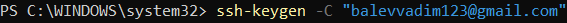
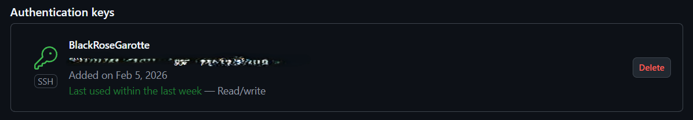
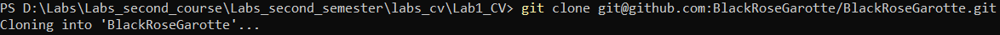
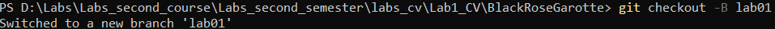
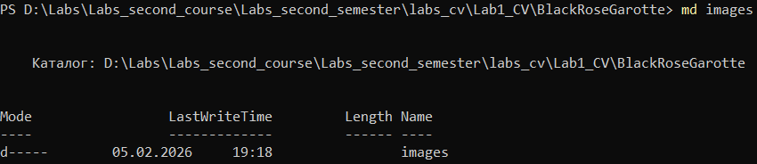
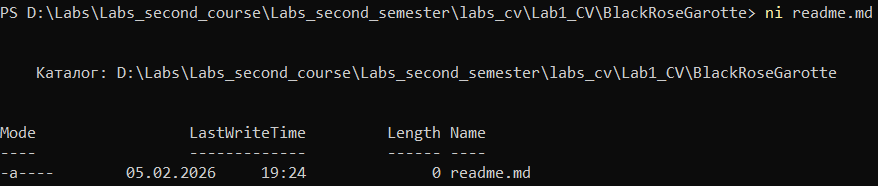
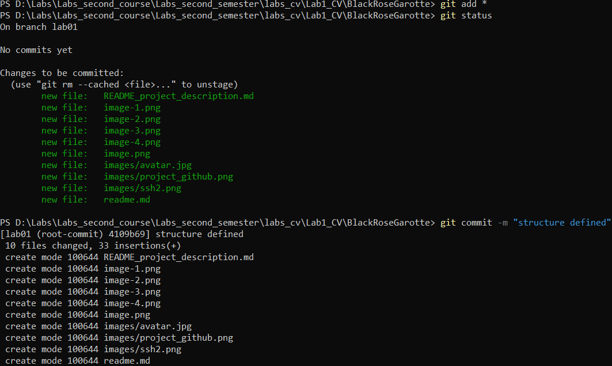
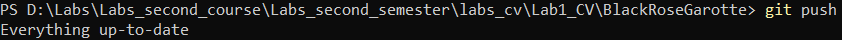

# Лабораторная работа №1

## Цель
Научиться работать с системой контроля кода GIT.

## Задание
Создать профильный проект в GitHub.

## 1. Регистрация GitHub

Этот шаг был пропущен, так как учетная запись GitHub была зарегистрирована ранее.

## 2. Создание проекта
Был создан репозиторий, совпадающий с логином в GitHub.

## 3. Копирование репозитория на локальный компьютер
Я создал пару ключ значение для аутентификации на GitHub через SSH. Публичный код я вставил в свой профиль.

Далее была скопирована SSH-ссылка из GitHub, а затем был использован git clone.

Создание новой ветки для работы.

## 4. Создание структуры файлов
Создание папки images для всех изображений.

Создание файла readme.md

## 5. Добавление описания проекта

Был создан readme-файл с личной информацией.

## 6. Публикация кода на GitHub

Последним шагом стала загрузка проекта на GitHub.

## Вывод

В ходе лабораторной работы был создан проект и загружен на GitHub. Были изучены основы работы с Git и был создан readme-файл.